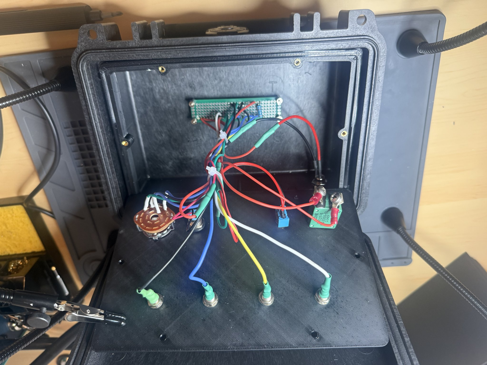
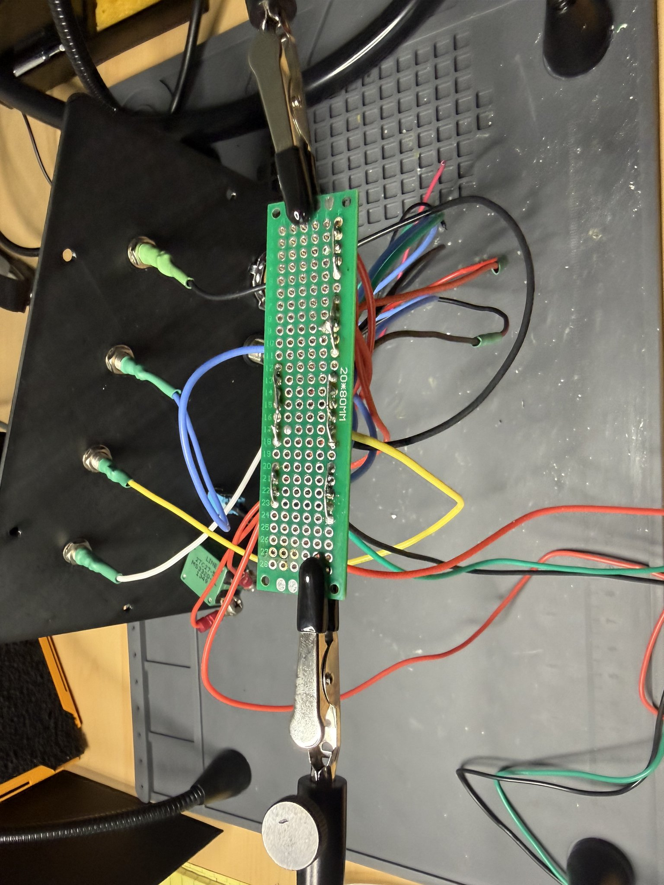

# TACTRACE Trainer
### 24V DC Wire Fault Injection Training System

---

## Overview
TACTRACE is a modular hardware training system designed to teach electrical troubleshooting through controlled fault injection in a 24V DC environment.

The system enables users to diagnose realistic wiring faults using standard test equipment such as multimeters and test leads, replicating real-world maintenance scenarios.

---

## Purpose
The goal of TACTRACE is to bridge the gap between theoretical knowledge and hands-on troubleshooting by providing:

- Controlled and repeatable fault conditions
- Realistic electrical behavior
- Safe training environment
- Scalable architecture for advanced fault simulation

---

## Current Version — V1.3 Prototype

- 4-position rotary fault selector
- Fault simulation modes:
  - Normal Operation
  - Open Circuit
  - Short to Ground
  - Short to Power
- LED load indication
- 5A aircraft-style circuit breaker
- Panel-mounted power switch
- Panel-mounted female banana jack test points
- Pelican 1120 enclosure with integrated control panel

### Test Points

| Label | Location | Function |
|------|---------|--------|
| TP1 | After circuit breaker | Verifies protected input power |
| TP2 | Before rotary switch (after power switch) | Verifies power entering fault selector |
| TP3 | After rotary switch (fault node) | Displays selected fault condition |
| TP4 (GND) | After load / ground return | System ground reference |

---

## System Architecture
24V Input
   ↓
Circuit Breaker
   ↓
TP1
   ↓
Power Switch
   ↓
TP2
   ↓
Rotary Switch (Fault Selector)
   ↓
TP3
   ↓
Load (LED)
   ↓
TP4 / GND

The rotary switch controls how the TP3 node behaves, allowing trainees to observe and diagnose system faults.

---

## Training Use Case

TACTRACE enables trainees to:

- Measure voltage at key points (TP1, TP2, TP3, TP4/GND)
- Identify fault conditions using a multimeter
- Understand the electrical impact of:
  - Opens
  - Shorts
  - Ground faults
- Practice systematic troubleshooting techniques

---

## Key Engineering Decisions

- **1kΩ 1W resistor** selected for thermal margin at 24V
- **True SP4T rotary switch** required for isolated fault selection
- **Female banana jacks** chosen for safety and compatibility with standard test leads
- **M2 mounting hardware** used to prevent perf board damage

---

## Known Limitations (V1)

- Minor contact arcing when switching under load (short-to-power position)
- Mechanical switching limits scalability
- Single-channel fault simulation

---

## Version History

### V1.3
- Relocated TP1 to be measured before the power switch (post-circuit breaker)
- Improved diagnostic flow by separating protection and control stages
- Enhanced troubleshooting clarity for power distribution faults

### V1.2
- Replaced automotive fuse with aircraft-style circuit breaker for improved control and realism
- Transitioned from male banana plugs to panel-mounted female banana jacks
- Improved safety and compatibility with standard test equipment

### V1.1
- Integrated components into a Pelican 1120 enclosure
- Introduced structured control panel layout
- Improved system durability and portability

### V1.0
- Initial circuit concept and functional validation
- Basic fault simulation using rotary switch

---

## Future Development

### Next Development Steps
- Add transient suppression capacitor at TP2 to reduce switching arcing
- Evaluate need for series resistance on short-to-power path
- Conduct peer review and gather user feedback on training effectiveness
- Refine internal wiring layout for improved serviceability
  
### V2 — Solid-State Fault System
- MOSFET-based switching
- Microcontroller integration
- Multi-channel fault injection (16+ faults)
- Programmable fault scenarios
- Intermittent and time-based faults

### Long-Term Vision
- Instructor-controlled training modes
- Scenario-based troubleshooting exercises
- Modular expansion (multiple wire systems)
- Aviation and maintenance training applications

---

## Hardware Components

- 24V DC input system
- SP4T rotary switch (fault selector)
- 5A pull-type circuit breaker
- Panel-mounted toggle power switch
- LED indicator/load
- 1kΩ 1W resistor
- Female banana jack connectors
- Perf board prototype assembly
- Pelican 1120 enclosure

---

## Prototype (V1.3)

### Front Panel

### Internal Wiring

### Perf Board

---

## Lessons Learned

- Switching under load introduces contact arcing
- Capacitors reduce transients but do not limit current
- Proper switch selection is critical (SP4T vs fan switches)
- Connector choice significantly impacts usability and safety
- Mechanical layout is as important as electrical design
- Test point placement significantly impacts troubleshooting effectiveness
- Separating circuit protection, control, and fault injection stages improves diagnostic clarity
- Component selection (circuit breaker vs fuse) directly affects training realism
- Panel interface design improves usability and system understanding

---

## Engineering Insight

TACTRACE demonstrates the transition from:
Manual fault simulation → Programmable fault systems
and serves as a foundation for developing scalable, microcontroller-driven training platforms.

---

## Status

🟢 Active Development — V1 Prototype Near Completion  
🟡 V2 Architecture (MOSFET + MCU) In Planning  

---

## 👤 Author

Jeremy Surgeon  
TACTRACE Development

---

## Contributors

The development of TACTRACE was supported by the following individuals:

- Nicholas Brewster  
- Joseph Chevalier  
- Derek Holt  
- Thomas Mattern  
- Lamonte McCoy  
- James Scott  
- Joshua Webb 

Contributions included design feedback, troubleshooting support, and prototype validation.
