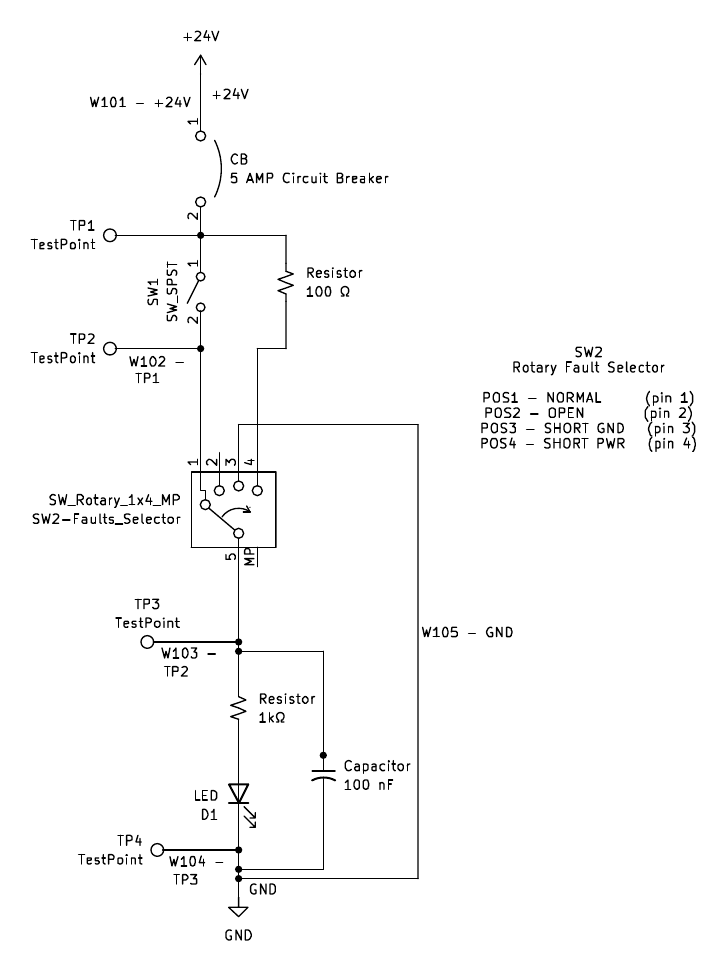
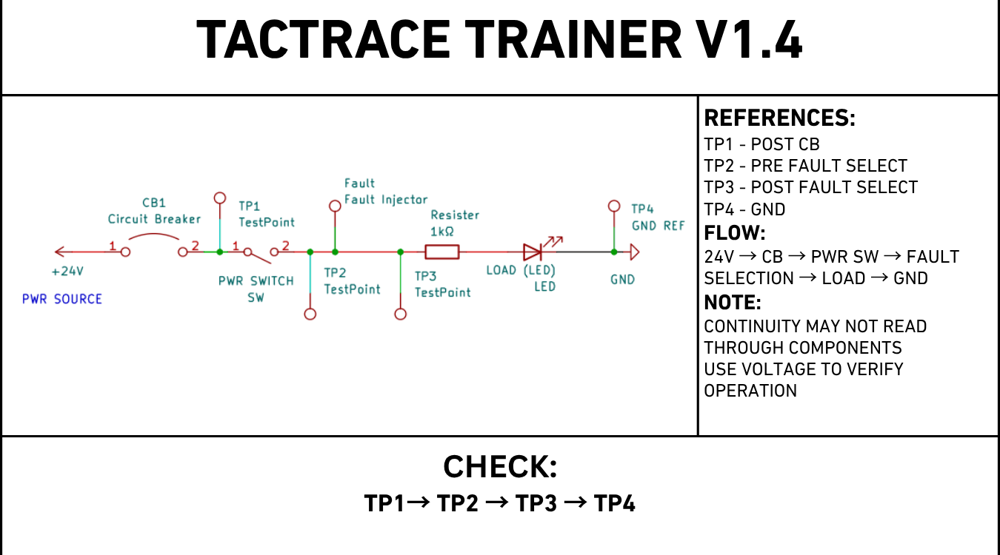
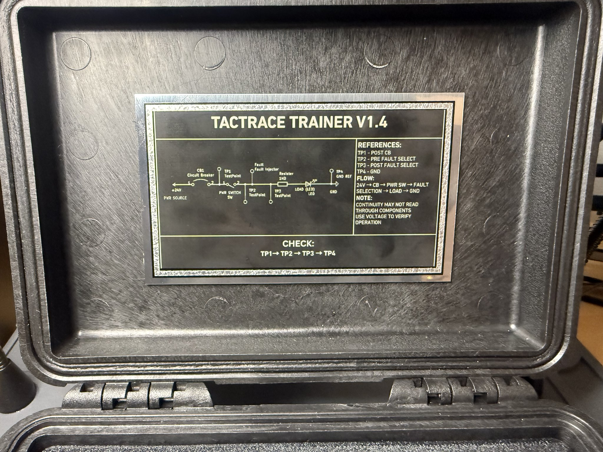
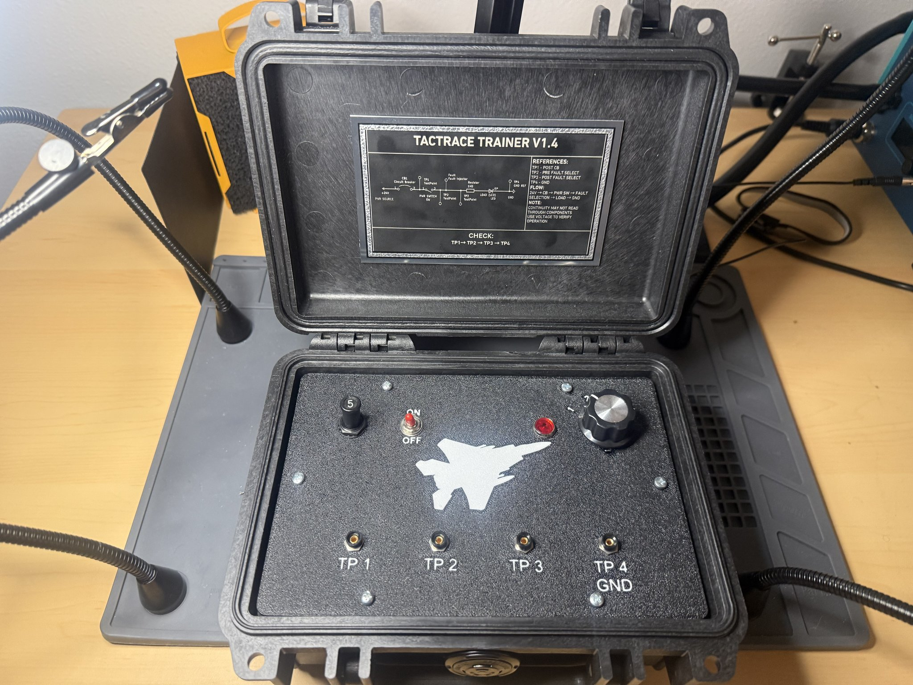
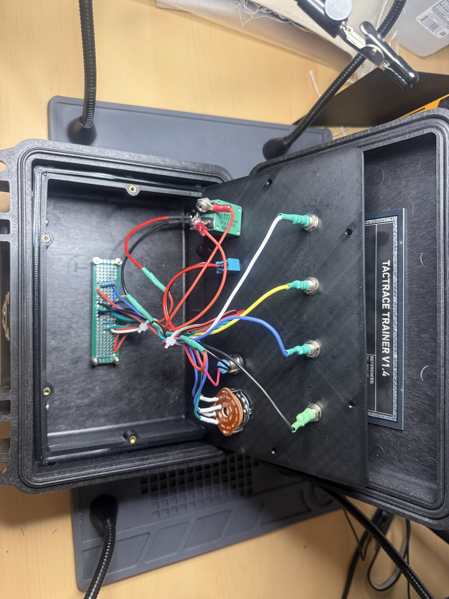
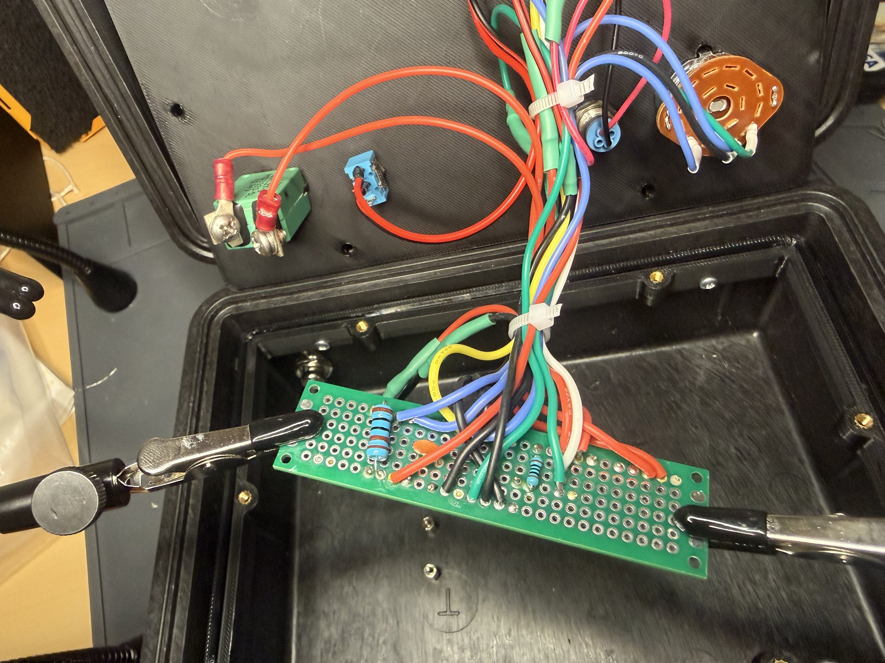
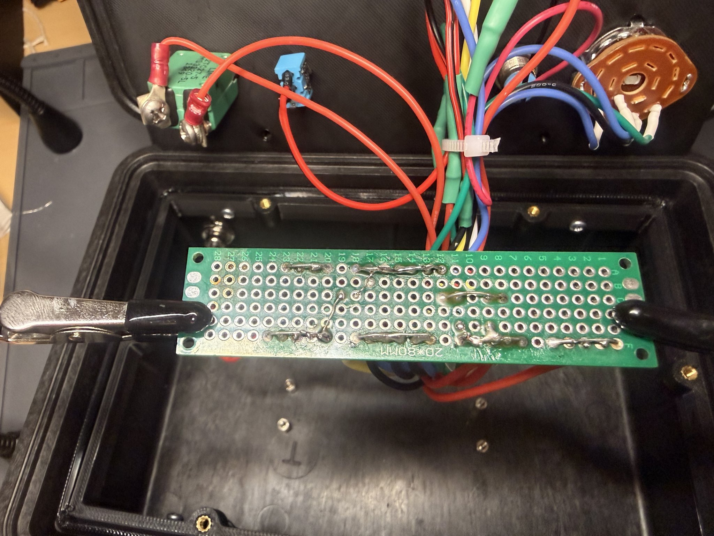

# TACTRACE Trainer

### 24V DC Wire Fault Injection Training System

> **Status:** V1.4 Prototype Complete — Validation Ongoing
> **Author:** Jeremy Surgeon
> **Built by an active-duty F-15 avionics technician for hands-on troubleshooting training.**

---

## Overview

TACTRACE is a portable, bench-top hardware trainer that teaches electrical troubleshooting through controlled fault injection on a 24 V DC bus. Trainees diagnose realistic wiring faults, opens, shorts to ground, and shorts to power, using a digital multimeter and standard test leads, replicating the diagnostic process used on the flight line.

Most current electrical-troubleshooting instruction is either purely theoretical or relies on large, expensive classroom systems. TACTRACE replaces that with a small, rugged, low-cost trainer that travels to the unit, the schoolhouse, or the bench, and gives junior maintainers a safe, repeatable environment for voltage tracing, continuity checking, and structured fault isolation.

---

## Why This Matters

Junior maintainers learn electrical troubleshooting from manuals, lectures, and the occasional broken component handed to them on the flight line. That mix produces uneven readiness; some maintainers can isolate a wiring fault with a multimeter in two minutes, others swap parts until the symptom disappears. The difference is hands-on repetition, and current training programs offer very little of it.

TACTRACE closes that gap. It puts a controlled, repeatable, multimeter-driven fault scenario in the hands of every junior maintainer who needs one — at the unit, in the schoolhouse, or on a workbench. The result is faster fault isolation, fewer parts swapped on a hunch, and measurable improvement in troubleshooting proficiency before the maintainer is put into the troubleshooting loop on a real aircraft system.

---

## Skills Demonstrated

- **Electrical design** — 24 V DC fault-injection circuit, contact-arc mitigation, deliberate component selection (breaker vs. fuse, 1P4T rotary, snubber sizing)
- **Schematic capture (KiCad)** — V1.0 through V1.4 revisions, with controlled annotation
- **Mechanical design (FreeCAD)** — Pelican 1120 enclosure model, panel-engraving art, test-point ergonomics
- **Iterative engineering discipline** — five hardware revisions with documented rationale at each step
- **Technical writing** — schematic, BOM, training guide, instructor reference, design briefs
- **Training curriculum design** — trainee worksheet, instructor evaluation rubric, scenario-based fault diagnosis
- **Troubleshooting methodology** — voltage tracing, continuity testing, evidence-based fault isolation

---

## Current Version — V1.4: Rotary Selector Contact Protection Revision

V1.4 is the current hardware revision. The contact-protection components are installed and operational; quantitative validation under measured load is in progress.

### Hardware Configuration

- 24 V DC supply via panel-mount barrel jack (external 24 V 3 A 72 W AC/DC adapter)
- 5 A pull-type circuit breaker, aircraft-style (Klixon 2TC2-5)
- Panel-mount toggle power switch
- 4-position **1P4T rotary selector switch** (fault selector)
- LED load with 1 kΩ 1 W series resistor
- Female panel-mount banana jacks for TP1 / TP2 / TP3 / TP4
- Pelican 1120 enclosure with engraved control panel
- **V1.4 contact-protection additions:**
  - **100 nF ceramic capacitor** connected from TP3 node to ground — for switching transient suppression during selector transitions
  - **100 Ω resistor** on the **Position 4 (Short to Power)** path — for current limiting through the rotary contact

> Validation of the V1.4 contact-protection components under measured load is pending — _Needs peer review._ The detailed V1.4 schematic with the 100 Ω on the Pos 4 path is published at [`hardware/schematics/v1_4_schematic_detailed.pdf`](hardware/schematics/v1_4_schematic_detailed.pdf); post-release housekeeping (refdes, peer-review confirmation of the 100 Ω routing, component-rating confirmation) is tracked in [`archive/SCHEMATIC_V1_4_REGENERATION.md`](archive/SCHEMATIC_V1_4_REGENERATION.md).

### Fault Selector Positions

| Position | Fault Condition | Description                                                  |
| -------: | --------------- | ------------------------------------------------------------ |
|        1 | Normal          | Healthy circuit — power flows through the load to ground     |
|        2 | Open Circuit    | Path between TP2 and TP3 broken                              |
|        3 | Short to Ground | TP3 shorted to ground return                                 |
|        4 | Short to Power  | TP3 fed from supply through 100 Ω current-limit on this path |

A 100 nF capacitor is permanently connected from the TP3 node to ground; it is not switched by the selector and is active in all positions, providing transient suppression during selector transitions.

### Test Points

| Label | Location                             | Function                                   |
| ----- | ------------------------------------ | ------------------------------------------ |
| TP1   | After circuit breaker, before switch | Verifies protected input power             |
| TP2   | After power switch, before selector  | Verifies power entering the fault selector |
| TP3   | After fault selector, before load    | Displays the selected fault condition      |
| TP4   | Load return / ground reference       | System ground reference                    |

---

## System Architecture

```
+24 V Supply  ->  CB (5 A pull)  ->  TP1
                                       |
                                       v
                                Power Switch
                                       |
                                       v
                                      TP2
                                       |
                                       v
                       Fault Selector (1P4T rotary)
                       |-- Pos 1: Normal pass-through
                       |-- Pos 2: Open
                       |-- Pos 3: Short to Ground
                       '-- Pos 4: Short to Power (100 ohm on path)
                                       |
                                       v
                                      TP3 ---||--- GND   (100 nF transient cap)
                                       |
                                       v
                            1 kohm  ->  LED  ->  TP4 / GND
```

The rotary selector determines the behavior of the TP3 node, allowing the trainee to deduce the active fault by comparing measurements at TP1–TP4.

---

## V1.4 Schematic



The V1.4 detailed schematic shows the full signal path from the +24 V supply through the circuit breaker (CB), main power switch (SW1), the 1P4T rotary fault selector (SW2), the 100 nF transient-suppression capacitor on the TP3 node, the 1 kΩ load resistor + LED, and back to GND. The 100 Ω current-limit feeding **Pos 4 (Short to Power)** is drawn explicitly, fed from the post-breaker rail. Reference designators (R1, C1, …) are not yet annotated and a peer-review confirmation of the 100 Ω routing intent is pending — see [`archive/SCHEMATIC_V1_4_REGENERATION.md`](archive/SCHEMATIC_V1_4_REGENERATION.md) for the post-release housekeeping list.

The PDF exports and KiCad source are in [`hardware/schematics/`](hardware/schematics/) and [`hardware/kicad/`](hardware/kicad/). A simplified block-level view is also available at [`hardware/schematics/v1_4_schematic_simplified.pdf`](hardware/schematics/v1_4_schematic_simplified.pdf) for orientation.

---

## V1.4 Panel Engraving



The lid engraving doubles as a quick-reference card: test-point flow (TP1 → TP2 → TP3 → TP4), system flow (24 V → CB → PWR SW → FAULT SELECTION → LOAD → GND), and the reminder that continuity may not read through the load — voltage measurements should be used to confirm operation.



The reference plate installed in the lid of the V1.4 enclosure — visible to the trainee while the unit is open and powered.

---

## Training Use Case

Instructors set the rotary to an unknown fault and ask the trainee to diagnose it. Trainees use TACTRACE to measure voltage at TP1–TP4 under each fault condition, recognize the electrical signature of opens, shorts to ground, and shorts to power, and practice systematic, evidence-based troubleshooting.

The full V1 training guide PDF (trainee worksheet + instructor reference + evaluation rubric) is in [`docs/TACTRACE_V1_Training_Guide.pdf`](docs/TACTRACE_V1_Training_Guide.pdf). The V1.4 quickstart — written for a maintainer who has never seen the device — is at [`docs/Quickstart.md`](docs/Quickstart.md). A V1.4-revised full training guide that maps the V1 three-test-point set to the V1.4 four-test-point set is in progress.

---

## Hardware & Documentation Deliverables

| Asset                                          | Location                                                                                                 | Status                                    |
| ---------------------------------------------- | -------------------------------------------------------------------------------------------------------- | ----------------------------------------- |
| V1.4 detailed schematic (KiCad export, PDF)    | [`hardware/schematics/v1_4_schematic_detailed.pdf`](hardware/schematics/v1_4_schematic_detailed.pdf)     | Published                                 |
| V1.4 simplified schematic (PDF)                | [`hardware/schematics/v1_4_schematic_simplified.pdf`](hardware/schematics/v1_4_schematic_simplified.pdf) | Published                                 |
| V1.4 KiCad source                              | [`hardware/kicad/`](hardware/kicad/)                                                                     | Published                                 |
| Bill of materials (CSV, machine-readable)      | [`hardware/BOM.csv`](hardware/BOM.csv)                                                                   | Published                                 |
| Bill of materials (PDF, human-readable)        | [`hardware/BOM.pdf`](hardware/BOM.pdf)                                                                   | Published                                 |
| V1.4 quickstart                                | [`docs/Quickstart.md`](docs/Quickstart.md)                                                               | Published                                 |
| V1 training guide PDF (interim)                | [`docs/TACTRACE_V1_Training_Guide.pdf`](docs/TACTRACE_V1_Training_Guide.pdf)                             | Interim — V1.4 revision in progress       |
| User-feedback questionnaire (instrument)       | [`docs/TACTRACE_User_Feedback_Questionnaire.csv`](docs/TACTRACE_User_Feedback_Questionnaire.csv)         | Published                                 |
| Peer-feedback summary (initial round, _n_ = 5) | [`docs/Peer_Feedback_Summary.md`](docs/Peer_Feedback_Summary.md)                                         | Published                                 |
| Demo video (~60 s)                             | Linked from the GitHub release page (file too large to commit to the repo body)                          | Release attachment                        |
| Enclosure CAD                                  | [`hardware/enclosure/`](hardware/enclosure/)                                                             | **Deferred** — see Enclosure Status below |

---

## Validation & Initial Peer Feedback

Initial peer feedback was collected from **avionics maintainers** across three skill levels: two 3-Level Apprentices, two 5-Level Journeymen, and one 7-Level Craftsman (n = 5). All five reported the test points and controls were clear, and that the trainer helped them understand the troubleshooting concepts being taught. A summary of the responses and a transcript of the open-text themes is in [`docs/Peer_Feedback_Summary.md`](docs/Peer_Feedback_Summary.md); the underlying questionnaire is at [`docs/TACTRACE_User_Feedback_Questionnaire.csv`](docs/TACTRACE_User_Feedback_Questionnaire.csv) (surveyor identifying information masked).

This is **preliminary feedback at _n_ = 5** — it indicates that the trainer was usable and that the test-point layout communicated clearly to the reviewers. It does **not** constitute validation of training effectiveness, learning gains, retention, or transfer to flight-line tasks. A larger feedback round with pre/post measurement is a separate effort, not a V1.4 deliverable.

The V1.4 contact-protection components (100 nF capacitor, 100 Ω resistor) are installed and operational, but **quantitative validation under measured load is pending**. Where the schematic, BOM, or documentation states a value or placement that has not yet been confirmed by measured testing or independent peer review, that item is flagged in this README as **"Needs peer review"** or in the source files as **"Needs verification."**

---

## Enclosure Status

The TACTRACE V1.4 trainer is housed in a **Pelican 1120 enclosure** with an engraved control panel and engraved lid quick-reference plate (both V1.4 deliverables, photographed in this README). The mechanical layout is operational and trainee-validated by the initial peer-feedback round.

**A finalized 3-D enclosure CAD model is not part of the V1.4 release.** The CAD work is intentionally deferred while the project transitions from FreeCAD to **SolidWorks** (license pending). The current enclosure is documented through the panel-engraving art, the lid-engraving art, and the photographic record in [`images/`](images/) — not through a parametric CAD source. The `hardware/enclosure/` folder is reserved for the SolidWorks model and exported PDFs, and will be populated in a later revision.

This means the repo currently lets a maintainer **rebuild the V1.4 electrical system** from the schematic and BOM, but **does not** let them re-machine an identical enclosure from CAD without consulting the photographs and the panel-engraving art. The gap is intentional and documented; it is not an oversight.

---

## Key Engineering Decisions

- **5 A pull-type circuit breaker** instead of an automotive fuse — for realism, repeatability, and physical authority during instruction.
- **1P4T rotary selector switch** instead of a fan-style multi-pole — so each fault position electrically isolates the others.
- **Female panel-mount banana jacks** — for compatibility with standard maintainer test leads.
- **1 kΩ 1 W resistor** for thermal margin at 24 V (≈576 mW worst-case dissipation).
- **M2 mounting hardware** to reduce perfboard damage during enclosure work.
- **100 nF ceramic capacitor from TP3 to ground (V1.4)** — for switching transient suppression during selector transitions, suppressing the contact-arc transient that occurs as the rotary wiper makes/breaks under load. _Needs peer review under measured load._
- **100 Ω resistor on the Short-to-Power path (V1.4)** — for current limiting through the rotary contact during the Pos 4 transition. _Needs peer review under measured load._

---

## Known Limitations

- Mechanical rotary switching is the long-term scaling bottleneck — it limits fault count and introduces wear.
- Single-channel: only one fault can be active at a time.
- V1.4 arc-mitigation parts (100 nF / 100 Ω) reduce — but do not eliminate — switching transients on the rotary contacts. _Quantitative validation pending._
- TACTRACE is **not** certified for use on or with airworthy aircraft. Trainer use only.

---

## Version History

### V1.4 — Rotary Selector Contact Protection Revision

- Added 100 nF ceramic capacitor from TP3 to ground for switching transient suppression during selector transitions
- Added 100 Ω resistor on the Position 4 (Short to Power) path for current limiting through the rotary contact
- Refined V1.4 schematic and produced the lid-engraving panel quick-reference card

### V1.3 — Test Point Architecture Refinement

- Relocated TP1 to read protected input power (post-breaker, pre-switch)
- Separated protection, control, and fault-injection stages into distinct measurable nodes
- Improved diagnostic clarity for power distribution faults

### V1.2 — Aircraft-Realism Pass

- Replaced automotive fuse with aircraft-style 5 A pull-type circuit breaker
- Transitioned from male banana plugs to panel-mounted female banana jacks

### V1.1 — Enclosure Integration

- Integrated components into a Pelican 1120 enclosure with structured control panel layout
- Improved durability and portability for transport between training sites

### V1.0 — Functional Validation

- Initial circuit concept, four-position rotary fault selector, and bench-validated fault injection

The full per-version changelog is maintained in [`CHANGELOG.md`](CHANGELOG.md).

---

## Roadmap — Toward V2

V1.4 is the final mechanical-switching revision. V2 transitions to a solid-state, microcontroller-driven fault matrix.

- **MOSFET-based solid-state fault injection** replacing mechanical rotary switching
- **Microcontroller-controlled** scenario selection
- **16+ programmable faults**, including intermittent and time-based conditions
- Instructor-side scenario presets with **randomized fault delivery** for evaluation
- **Aircraft-style cannon plug connectors** to mirror real flight-line interfaces
- Improved enclosure layout, serviceability, and instrumentation
- Long-term: instructor-controlled training mode with student-evaluation logging, modular expansion across multiple wire systems, scalable deployable platform for squadrons, schoolhouses, and maintenance training units

A formal V2 design brief will be published in `docs/V2_design_brief.md`.

---

## Prototype Photos

The physical enclosure and front-panel layout are unchanged from V1.3; the V1.4 revisions are the engraved lid quick-reference and the internal contact-protection components on the rotary-selector paths.

### V1.4 Trainer — Lid Engraved, Front Panel Powered



### V1.4 Internal Wiring



### V1.4 Perfboard — Component Side



### V1.4 Perfboard — Solder Side



### Earlier Revision Reference (V1.3)

The V1.3 prototype shots below are retained for revision-history context — the V1.4 trainer above is the current build.

<details>
<summary>V1.3 prototype photos</summary>


</details>

---

## Lessons Learned

- Switching under load produces measurable contact arcing on a mechanical rotary — design has to plan for it, not ignore it.
- Switch and connector selection have an outsized effect on usability and safety; a 1P4T rotary selector behaves very differently from a fan-style multi-pole switch.
- Mechanical layout — test-point spacing, label placement, enclosure ergonomics — is as important to training value as the electrical design.
- Separating circuit protection, control, and fault injection into distinct measurable nodes (TP1 / TP2 / TP3) directly improves diagnostic clarity.
- Component selection (breaker vs. fuse, panel jacks vs. plugs, engraved labels) directly affects how the trainer feels in a maintainer's hands and how quickly trainees learn from it.

---

## Repository Layout

```
TACTRACE-Trainer/
├── README.md          ← project overview (this file)
├── CHANGELOG.md       ← per-version change history
├── LICENSE            ← project license
├── .gitignore         ← excluded build/backup/OS artifacts
├── docs/              ← training guides, design briefs, instructor reference
├── hardware/          ← KiCad schematic & PCB, BOM, FreeCAD enclosure, exports
├── images/            ← photos, schematic art, panel engraving art
├── logs/              ← bench validation, peer review notes, test records
└── versions/          ← per-version archive of source files (V1.0 → V1.4)
```

Each subfolder contains its own README.

---

## Disclaimer

TACTRACE is an independent training device. **It is not certified, qualified, or approved for use on or with airworthy aircraft.** It is intended solely for bench-top training of electrical fault-isolation skills. Engineering claims not yet validated by measured testing or peer review are marked **"Needs peer review."**

---

## Author

**Jeremy Surgeon** — TACTRACE Development

## Contributors

Design feedback, troubleshooting support, and prototype validation contributed by:

Nicholas Brewster · Joseph Chevalier · Derek Holt · Thomas Mattern · Lamonte McCoy · James Scott · Joshua Webb

---

## License

Released under the [MIT License](LICENSE). Hardware design files, training documentation, and panel art in this repository are distributed under the same terms.

> A hardware-specific license such as [CERN-OHL-P](https://ohwr.org/cern_ohl_p_v2.txt) (Permissive) may be adopted in a future revision for files under `hardware/`, while keeping documentation and software under MIT. This is under consideration; the project is currently MIT-only.
